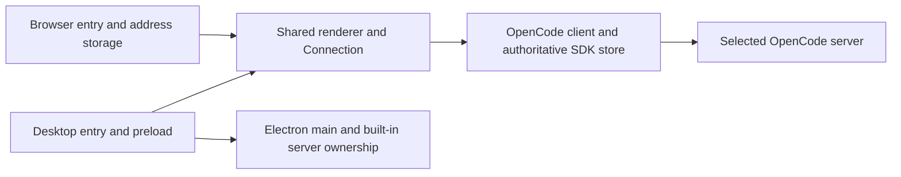

# Browser mode

Browser mode is a supported host for ordinary work and full-app verification.
It connects to an independently running OpenCode server and uses the same App,
workspace, styles, client, and SDK store as Electron. Chromium is the initial
verified browser target; Firefox and Safari need a compatibility pass before
being claimed as supported.

## Run and build

```sh
pnpm dev          # Electron
pnpm dev:web      # Browser UI: http://127.0.0.1:5173
pnpm build:web    # Static assets: apps/desktop/dist-web
pnpm preview:web  # Local build preview: http://127.0.0.1:4173
```

Start OpenCode separately or connect to a running server. The pinned server
library can be started with `OPENCODE_SERVER_PASSWORD=your-password pnpm dev:opencode`.
Browser commands do not launch Electron or the server library. Use
`pnpm dev:web --port 5185` when the default port is occupied, including by
Electron development.

For hosting beneath a static path, run `pnpm build:web --base /ocui/`. Deploy the
output directory through a normal static HTTPS host. Refresh HTML when deploying
new assets. Vite preview is for local inspection, not production hosting.
There is no service worker, offline queue, installed PWA, or API proxy.

## Host boundary

The entrypoint supplies one `AppHost` to the existing renderer owner:

- Desktop supplies `{ kind: "desktop", ...window.desktop }`, retaining the
  existing `DesktopApi`, IPC, secure settings, and built-in server operations.
- Browser supplies `{ kind: "browser", target }`, with address load/save/clear
  operations. It has no built-in-server methods or fake implementations.

Only startup, Connection, and the connection form depend on host capabilities.
Connection derives built-in availability once, guards unsupported local actions,
and uses remote defaults throughout browser startup, Forget, and recovery.
Connected feature components retain their existing data/callback contracts.



Separate entries select the host explicitly. A missing desktop bridge is not a
signal to silently enter browser mode. Shared mount setup applies host/platform
identity and the existing theme. Native titlebar spacing and drag regions apply
only to the desktop host, including on macOS.

The browser build has its own Vite configuration and output directory. Solid
setup, dependency optimization, styles, and assets are shared with Electron.
Main/preload and native server bundling stay in the desktop configuration.

## Storage and lifetime

Each browser tab owns one renderer runtime, Connection, workspace lifetime, and
SDK store. OpenCode remains authoritative for sessions, transcripts, filesystem
operations, and execution. A server directory is always on the server; browser
mode does not add access to the browser device's filesystem.

The browser host writes only `{ version: 1, serverUrl }` under
`ocui.connection.v1` in localStorage, after a successful connection. Schema
validation rejects corrupt data, unsupported versions, unexpected fields, and
invalid origins. Passwords are excluded by constructing the stored record from
the normalized address alone. They are never written to local/session storage,
URLs, build configuration, or logs.

| Action                     | Browser behavior                                                   |
| -------------------------- | ------------------------------------------------------------------ |
| Reload or open another tab | Prefill address, blank password, require explicit Connect          |
| Change server              | Release this workspace and credentials; retain address in the form |
| Forget                     | Release this workspace and remove its saved address                |
| Storage read failure       | Show a notice and allow manual connection                          |
| Storage write failure      | Keep the established connection and report that saving failed      |
| Forget failure             | Report failure; do not claim the saved choice was deleted          |
| Another tab saves/forgets  | Do not redirect or reconnect this tab; last storage write wins     |
| Hide the tab               | Keep its runtime alive; SDK owns reconnection and refresh          |
| Navigate away or close     | Request renderer disposal; do not stop the independent server      |
| Restore a cached page      | Reload the document to get a fresh owner and blank password        |

The password field clears after successful connection. The authenticated client
retains the credential for that connection's lifetime. Desktop retains its
existing secure persistence and saved-credential reconnect behavior.

Unsent drafts retain their existing workspace-memory lifetime. Reload, closing,
or changing the workspace can discard them. Server-admitted work stays owned by
the server. A lost acknowledgement must not trigger automatic mutation replay.
Page-exit events cannot guarantee awaited asynchronous cleanup, so important
mutations must not depend on unload handlers.

## HTTP, HTTPS, and hosting

One shared Schema validates server origins for renderer connections and desktop
settings. Both hosts accept HTTP and HTTPS, including trimmed input and normalized
host casing/default ports. Embedded credentials, non-root paths, queries, and
fragments are rejected. APIs served below a path such as `/opencode` remain
unsupported; expose a dedicated origin. This is separate from the UI's static
base path.

| UI origin                      | Server origin            | Support                                                              |
| ------------------------------ | ------------------------ | -------------------------------------------------------------------- |
| Local HTTP development/preview | HTTP or HTTPS            | Server origin permission; valid certificate for HTTPS                |
| Hosted HTTPS                   | HTTPS                    | Server origin permission and valid certificate                       |
| Hosted HTTPS                   | HTTP, including loopback | Rejected before sending a request; use local UI or an HTTPS endpoint |

The loopback rule is a deliberate initial limit. It avoids depending on
browser-specific mixed-content exceptions or local-network permission behavior.
Desktop does not have an HTTP page origin and is not subject to this page policy.

The pinned server `2.0.3` allows HTTP origins on `localhost:<port>` and
`127.0.0.1:<port>`. Hosted origins need an explicit allowlist entry; `--cors` can
repeat:

```sh
pnpm --filter desktop opencode:serve --port 4096 --cors https://ocui.example.com
```

The operator provides a reachable HTTPS endpoint, usually through a TLS reverse
proxy, and configures authentication. The proxy must preserve authorization,
preflight responses, and streaming without buffering. Origin permission and
server authentication are separate requirements. oc-ui does not expose or deploy
the server and does not bypass certificate checks.

The existing authenticated HTTP/event stream and exact protocol-version check
are unchanged. Readable password/version failures remain specific. Browser
network failures show address, network, certificate, and browser-access guidance;
JavaScript cannot reliably distinguish CORS, DNS, and TLS failures.

## Verification

`pnpm test` includes the existing unit and Storybook projects plus a `web` Vitest
project. The browser suite builds the real static app at `/ocui/`, launches its
own pinned server with isolated home/config/data and disposable Git fixtures,
and reuses the packaged suite's scripted provider. It uses Playwright through
Vitest, without another test runner or production test branches.

The HTTPS fixture terminates TLS locally with a disposable self-signed certificate.
Only its Playwright contexts accept that certificate; application certificate
validation and OS trust are unchanged. This verifies HTTPS requests, CORS, Basic
authentication, streaming, and recovery, not a public host's certificate setup.

Coverage includes connection/retry/change/forget, independent tabs and address-only
reload, denied/corrupt storage, HTTPS-page HTTP rejection, rejected CORS origins,
static base paths, absence of main/preload/Node imports in the browser bundle,
session/directory navigation, narrow layouts and focus restoration, prompts,
questions, Stop, transport recovery, annotations, reviews, and disposable worktree
creation/removal. Navigation and a persisted `pageshow` event exercise restored-page
startup; whether Chromium actually admits a streaming page to its cache is its
own decision. Closing the page must leave server health intact.

Use [App verification](app-verification.md) for change-specific checks. Browser
workflows complement desktop acceptance for IPC, secure settings, native layout,
built-in server ownership, and shutdown. The browser test does not establish
Firefox/Safari support, live-model compatibility, or native keychain behavior.
